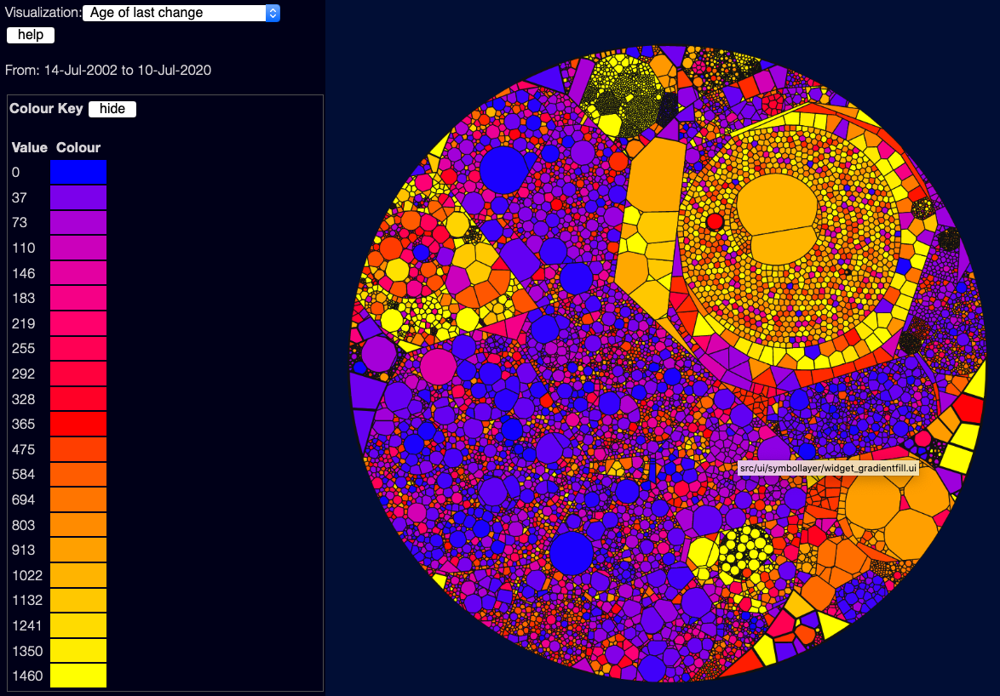
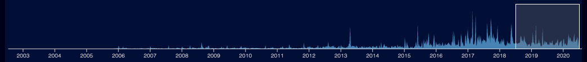

# Visualising Age since last change
(back to [metrics overview](/metrics/overview))

This view shows how long it is since each file was changed (from git history) - blue files are recently changed, red files haven't changed in a year, yellow files haven't changed in 4 years.  Note that this is affected by the date selector down the bottom of the page:

Files that haven't changed at all in the selected date range will show in grey.  You need to select the whole project (drag the left side of the selector to the left of the screen) to see change information across the whole scanned date range.

This is a good/bad/ugly scale again, largely because generally files that haven't changed for a long time are, in my experience, parts of the system that nobody understands or feels safe to touch.

However this is a bit contentious - it depends a lot on the culture of the organisation, and the kind of code - a lot of research in this field shows the flip-side of this, that files that haven't changed for ages are stable. If they had bugs, people would have touched them - so these files might be "safe".  Personally, coming from an agile world where shared code ownership is important, and rapid change is the norm, I see old untouched files as something that might show stagnation and maintenance nightmares - I think a lot of what is "good" here depends on what you are looking for.