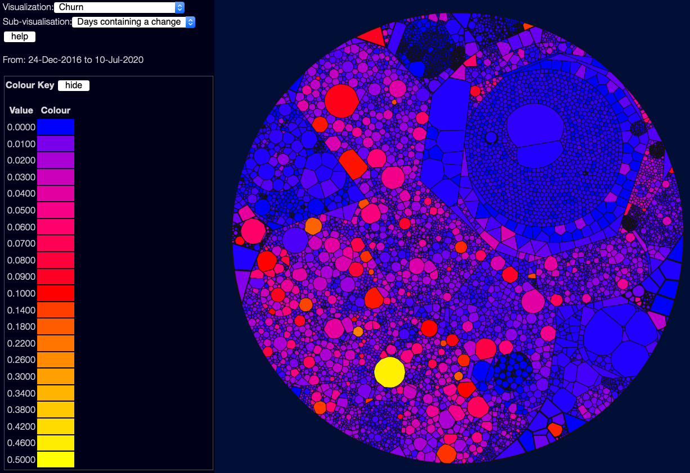

# Visualising Churn

(back to [metrics overview](/metrics/overview))

Churn shows the rate of change - how often a file has changed in the selected date window.  This again isn't necessarily good or bad - it depends a lot on what date range you are using.  If a file changes every work day over several years, that's probably bad!  But if it changes every day over the course of a short project, that might be fine.

There are three sub-visualisations here:

- Days containing a change - this is in proportion to the number of days selected.  So "0.5" means the file has changed every second day, on average.  This doesn't care how often in the day a file changed, so 10 commits on one day looks the same as 1 commit.
- Commits per day - this is the sum of commits, divided by the number of days.  So "0.5" means on average one commit every two days - but this might mean 150 commits on one day, and none the rest of the year.
- Lines per day - this is the sum of the number of lines changed (both adds and deletes) divided by the number of days.  So tiny tweaks to files won't show up nearly as brightly as large numbers of lines added or deleted.  Good for seeing where more work is being done.
