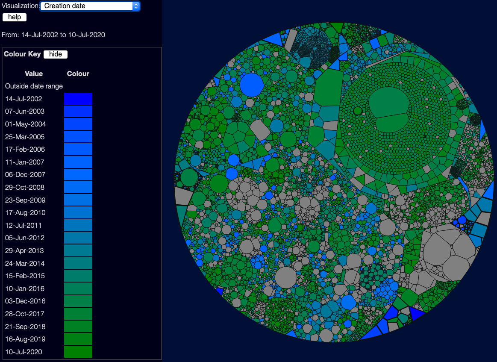

# Visualising Creation Date
(back to [metrics overview](/metrics/overview))

This _doesn't_ use a good/bad scale - it's not really about quality, but sometimes it's useful to know which files are new, and which are old.  This is especially handy when you are using the date selector, to give you a feel for how the code has changed over time.

See also discussion of the problems with the date selector [in the User Interface docs](/tools/explorer/ui#the-problem-with-the-date-selector)
