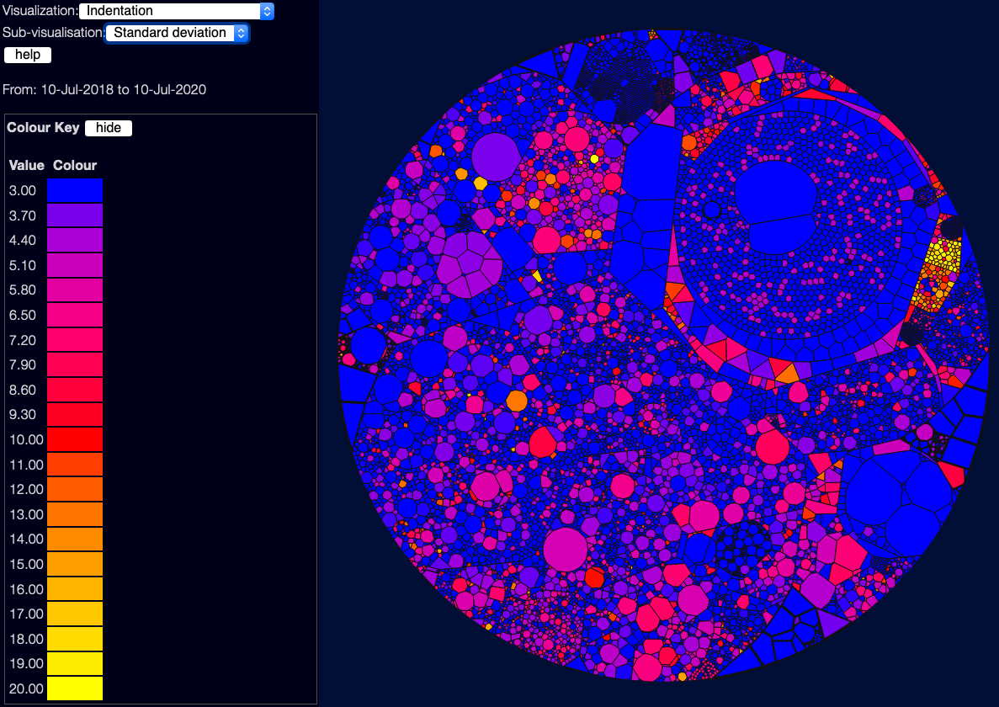

import Citation from '../../components/Citation.js'

(back to [metrics overview](/metrics/overview))

This metric is an interesting one. In <Citation to='(Hindle, Godfrey, and Holt 2008)'></Citation> they found that indentation is often useful as a way of looking for complexity - which makes common sense; files with a lot of indentation are often files with deeply nested "if" and "case" statements.  You can choose a few sub-visualisations using the drop-down near the top-left - the default shows the standard deviation of indentation, which is often the most useful metric; you can also see the worst indentation in each file, and the "total area" which is useful for showing files which are both large and deeply indented.

Of course this metric can have false positives - heavy indentation might be due to a particular formatting style for long lines, or an actually valid data structure, or other valid reasons.  But it is often surprisingly useful.
