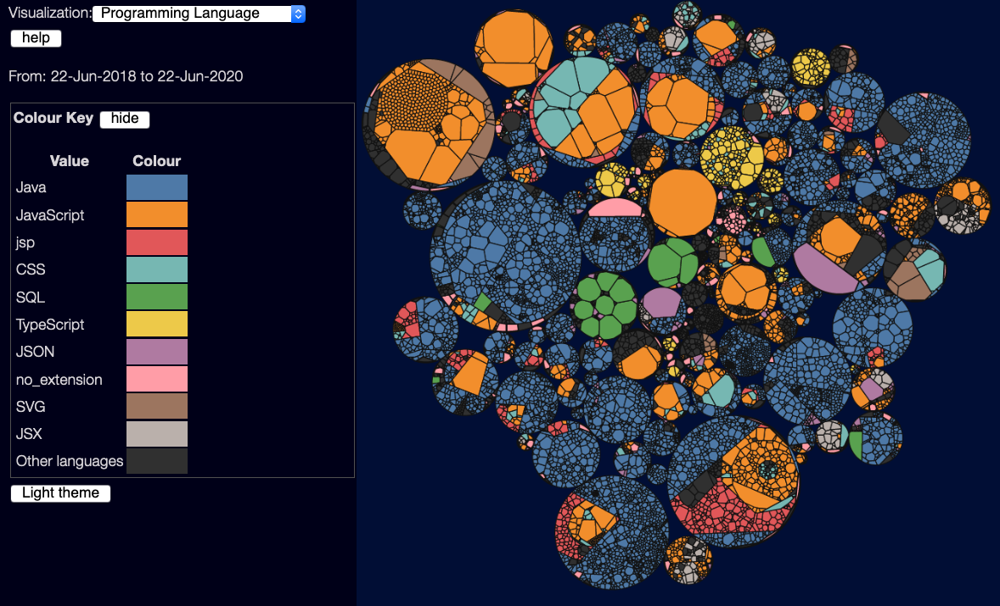

(back to [metrics overview](/metrics/overview))

This view is very simple - it just colours each file by programming language, showing the 10 most common languages.  Mostly useful for getting an overview of what goes where - it's usually easy to spot the front-end vs back-end code by the colours used.  (only 10 languages are shown because beyond that, it's hard to visually see different colours)