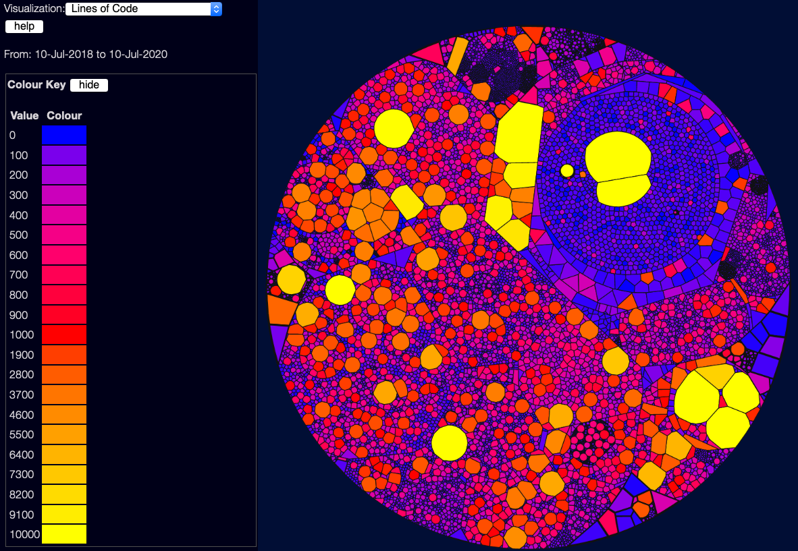

# Visualising Lines of Code

(back to [metrics overview](/metrics/overview))

This view is simple enough - it uses a scale from blue for tiny files, through to yellow for giant files.

Note that this is not a linear scale - a lot of these use what I call a "Good/Bad/Ugly" scale - blue (0) is good, red (1000) is bad, and yellow (10000 and above) is just ugly.  If I used a linear scale, it'd be harder to distinguish the good/bad files from each other.  (yes, I could use a log scale, but that has it's own problems)
