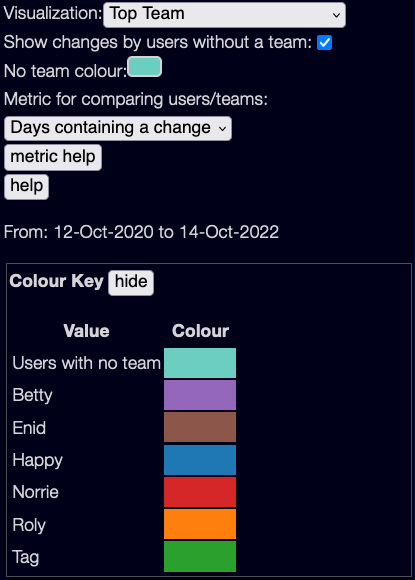
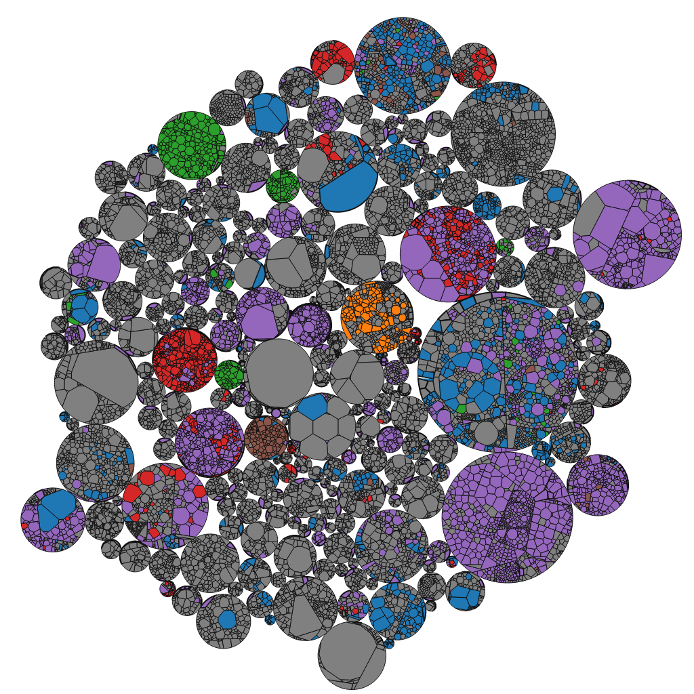
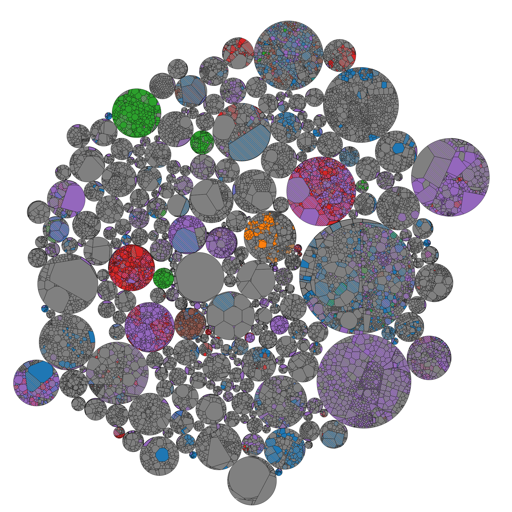
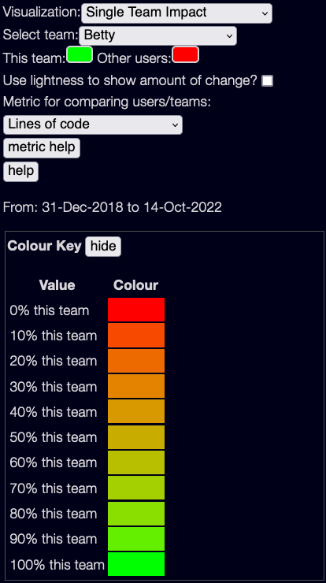
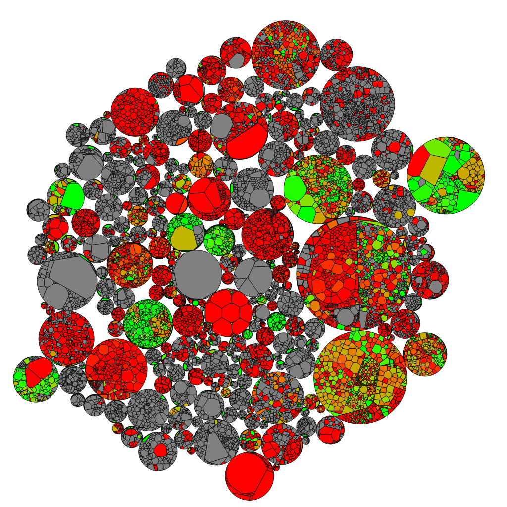
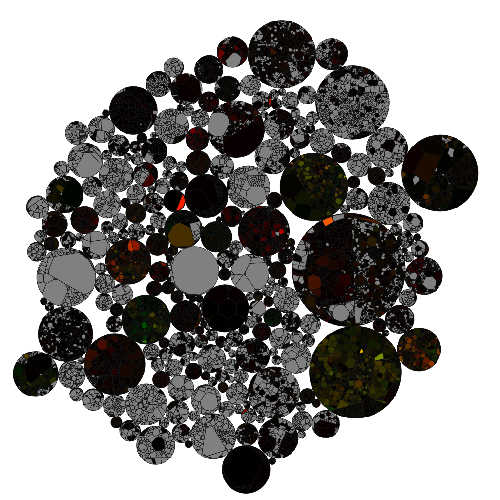
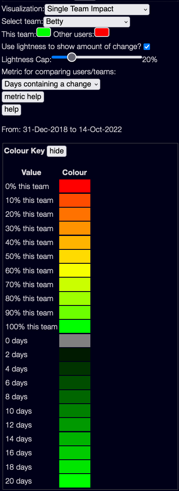
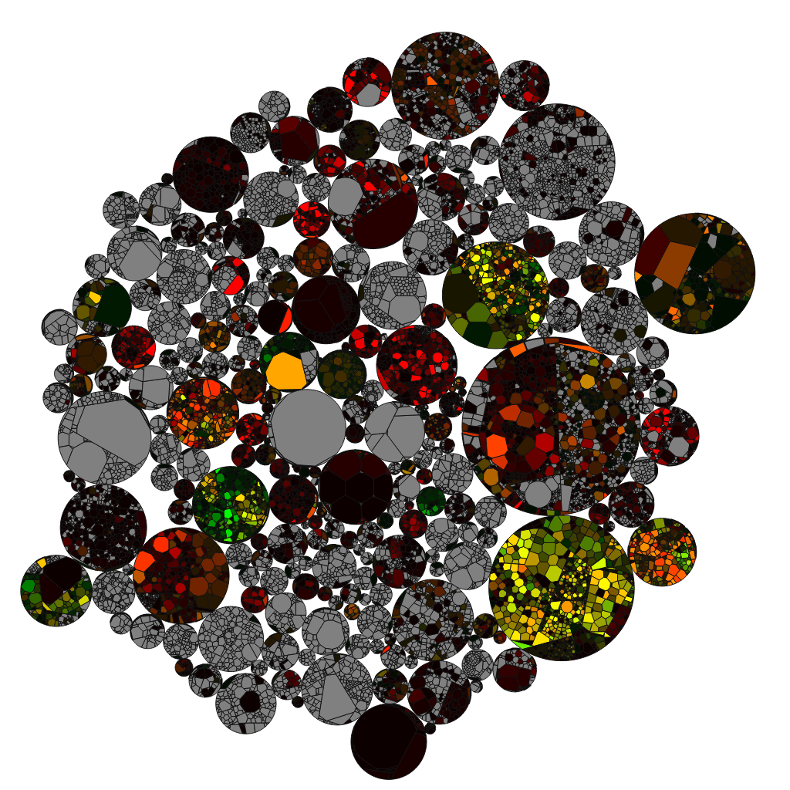

# Team Visualisations

(back to [metrics overview](/metrics/overview))

See also [the page on selecting a User/Team impact metric](./user-team-impact-metric) for the metrics used here.

Contents:

- [A note on the samples](#a-note-on-the-samples)
- [Top Team](#top-team)
- [Top Teams - Patterned](#top-teams---patterned)
- [Single Team Impact visualisation](#single-team-impact-visualisation)
  - [Without using lightness](#without-using-lightness)
  - [Using lightness to show amount of change](#using-lightness-to-show-amount-of-change)
- [Using the date selector](#using-the-date-selector)
- [A note on team collaboration and how it affects data](#a-note-on-team-collaboration-and-how-it-affects-data)

## A note on the samples

It's a bit hard to find open-source projects that have distinct teams!  Most are deliberately distributed, and often the same group of people touch everything - unlike a workplace, where teams might be deliberately focused on a single service.

My samples come from [OpenMRS](https://openmrs.org/) - an open medical records system, which has had many contributors over the years, often working together.  Still, the teams I'm using are pretty arbitrary based on guesswork mostly - don't assume this represents anything about actual OpenMRS developer organisation!

## Top Team

This is probably the simplest visualisation - it just colours each file based on the "top" team for that file - based on [the selected metric](./user-team-impact-metric)

The only new option here is "Show changes by users without a team" - if you select this, all users with _no_ team assigned will show up with a specific colour.  This is useful for projects where almost everyone is assigned to a team - I'm turning it off for these samples as I have only set up teams for a handful of users.

The "Top Teams" visualisation with these settings is:

This gives you an idea which projects are mostly authored by which teams.

Note that the metric chosen may change this view!

Also, this shows the **top** team.  If one team has made 51% of changes and another team has made 49% of changes, the first team and only the first team will be shown.

## Top Teams - Patterned

This is a possibly useful view, though my reading on visualisations suggest that there may be too much data here to be comprehensible!  Also it may be quite CPU heavy on large projects - and I haven't tested how SVG patterns perform on all browsers!

It tries to show _multiple_ team contributions, by cross-hatching the colours of each team together.  Each colour is divided into 3 stripes, corresponding to a %age of the total amount of change.

So if a single team has made all the changes, you will see a solid colour.  If one team has made 2/3 of the changes, the colour will be 2/3 the colour of that team, 1/3 the colour of the other team.

Here team Purple has made around 2/3 of the changes, team Red has made around 1/3 :

If three teams have contributed evenly you will see three stripes:

Changes made by non-team members will have a neutral grey colour.

The result, for the same teams as shown above, is:

> Aside: Note this is slightly more complex than dividing changes into 1/3 amounts - how it works is by apportioning work by 'quotas', a bit like [Australian senate voting](https://en.wikipedia.org/wiki/Australian_Senate#Electoral_system).  If team Betty has done 55% of the work, then they get 1 stripe (for 33% of the work) and have 22% overflow.  If team Enid has done 25% of the work, they will get the next stripe, and then team Betty will get a third stripe for their remaining 22% contribution.  A contribution of less than 1/6 (e.g. half of a stripe) will never be shown.

This visualisation, as I said before, is a bit experimental.  It probably works best with a small number of teams, using bright primary colours!

In my experience, more often you want to mostly see the impact of a _single_ team compared to all the other teams.  That's the goal of the next visualisation.

## Single Team Impact visualisation

This is used to look at a _single_ team, and see how much impact they are having compared to other teams.  (Note - it doesn't use the team colours from the other views, this has it's own colour scheme)

There are two main modes here - without using lightness, and with lightness:

### Without using lightness

You need to select a team first for this to work at all!

Then you can choose two colours - one for the selected team, and one for everybody else.  By default these are Green and Red.  The visualisation will blend the colours from 100% green for files entirely changed by the selected team, to 100% red for files changed by others.

(Note these are terrible colours for colourblind people - you can change them!)

The output for team Betty looks like this:

You can see what areas Betty has changed, what areas others have changed, and in grey are files not changed at all.

The only disadvantage here is that it doesn't show the _amount_ of change - if team Betty made a single line change it is just as bright as making thousands of changes.  That's what Lightness is used for.

### Using lightness to show amount of change

Now the lightness of each team is scaled by the total contribution - from the scale above, a contribution of 10 days or less is dark green, a contribution of 101 days is fully bright green.

However, the result is very dark!

This is because the colour scale by default is such that the brightest colour is reserved for the highest usage.  In this case, one file was changed on 101 days, so that file is lit up - but all the rest have much less change.

To get around this, you can use the "Lightness Cap" slider:

Here the lighness is capped at 20% of maximum - 20 days of changes here - and the results are more understandable:

## Using the date selector

Note that all of these visualisations are based on the current date selector!  You can quickly view behaviour over time by shrinking down the selector to a small time period, and dragging it left and right.

(It's worth reading [the problem with the date selector](/tools/explorer/ui#the-problem-with-the-date-selector) notes - files in the past may not be accurate with what was actually happening then)

## A note on team collaboration and how it affects data

Note that teams are quite flexible - a user can be in multiple teams, and file contributions might be made from people in multiple teams.

The way these visualisations work is by looking at each commit (well, actually it aggregates all commits by the same group of users on a given day, but the result is the same):

If the commit is by people all in the same team, it counts for that team.

If the commit is by people in two teams, it counts for both teams equally.  Even if 80% of the users are in team A and 20% in team B.

If the commit is by people in a team, and people not in a team, then it depends on whether you selected "Show changes by users without a team" - if you did, then the commit counts both for the team members, and for a pseudo-team "Non team members".

This can make strange effects if you have people who span multiple teams.  At one client there was a principal engineer who contributed to 3 different teams - if we had put them in all 3 teams, then any file they touched would show up as partially owned by all 3 teams!

In the end we assigned them to a special 'Principal Engineers' team, as it gave a clearer idea of actual team behaviour.
