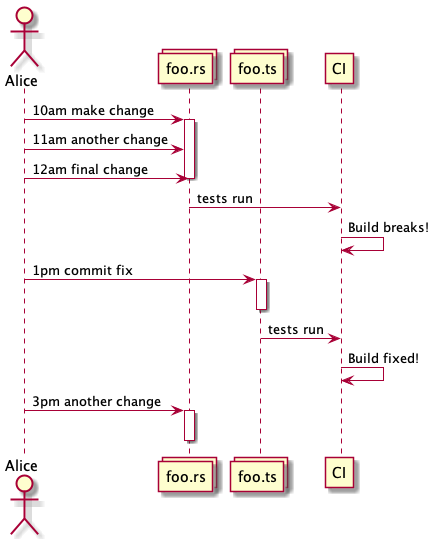

# Visualising Temporal Coupling

(back to [metrics overview](/metrics/overview))

Note that **this has significantly changed in March 2021** - the earlier version had issues, I'm hoping this one is more useful.

This is based on ideas from Adam Tornhill's books, plus some research - it tries to work out when files might be tightly coupled to each other, based on when the files change in git.  Adam calls this "Temporal Coupling".

If you show the coupling controls and then show coupling, you'll see a display like this:


(NOTE: this is from the older coupling logic, and needs updating!)

The curved lines show which files seem to be temporally coupled to which other files.

## What is coupling?

[Coupling](https://en.wikipedia.org/wiki/Coupling_(computer_programming)) is "the degree of interdependence between software modules; a measure of how closely connected two routines or modules are" - generally it is good to avoid tight coupling across large areas of your systems.

### What about "temporal coupling"?

Temporal coupling is a concept I foundin Adam Tornhill's books - the idea is that you can potentially detect coupling by looking at what files change at the same time.  If almost if almost every time someone changes `WidgetLogic.rs`, they also have to change `WidgetDisplay.ts` in a different module, then maybe those two files are tightly coupled.

If the files are in one source code repository, you can just check if they are in the same commit; but I wanted to extend the same idea to large codebases where you might have code split across multiple repositories.  This mostly comes from working in microservices architectures, where in theory services should be independantly deployable - but in practice, quite often people build "distributed monoliths" where services are actually tightly coupled.

Because temporal coupling is just about looking for "files that change around the same time", you can use this across multiple repositories - thought you have to allow a bit more flexibility around times - `WidgetLogic.rs` might be committed at 11am, and then this causes a build breakage and someone has to commit a fix to `WidgetDisplay.ts` at 11:30 to fix it...

## Limitations and caveats

### Sometimes it works, sometimes less so

There is a lot of "it depends" here - I've seen some examples where this looks useful; I've also seen repositories where it is next to useless.  I'd love to do more digging.  A _lot_ depends on how active your codebase is, and how tight your feedback loops are.  If you have 10 teams committing to 10 different areas of code at the same time, there is going to be far too much noise to find the coupling, at least with my techniques.  Maybe something that did more subtly things could pick up patterns of information, but it's beyond my little programs for now.

So you might get false positives; it also might miss genuine coupling.  It only looks at per-file stats - and I tend to filter out coupling that isn't in the 75% or more scale.  So you might have two services that are actually quite coupled which never hit that 75% ratio so aren't visible.

### It can be very very slow

The algorithm used is slow - it's worse than O(n) vs number of commits, might get towards O(n^2).  Basically it looks at every cluser of commits for a file, then finds all other commits on any other file in the same time window, and builds up stats.  For a large busy repo, that data can get very large.  I've seen the algorithm take 10 hours to run on the Spring sourcecode.  (This might be just ineffecient memory management and lots of swapping - I haven't had the chance to profile it properly yet)

### The data files can be too big to be manageable

Because you can get a lot of false positives, the data can grow quite significantly.  Initially I was following my usual philosophy, of storing a lot of data and then trimming it in the User Interface - but quickly I found that coupling data got huge.  Now I do a lot of filter in in the scanner first - but still, the data can get beyond the `node.js` size limit for a JSON file (2 gigabytes).

I suggest if you want to use this on a lot of code, you start with a small time scale - maybe only the last year of data - get the scanning parameters right, then re-run the scan with more data.

### You need to tweak the parameters for your coding patterns

There is more on this below - but if you have developers checking in occasionally and then gathering feedback via slow-ish continuous integration systems, you might need to set parameters which allow for larger time overlaps.  If you have a lot of developers checking in regularly and tight feedbacks, you might need to set those values lower.  There is no good "one size fits all" default parameters here; and this is annoying given how slow it is to get results.

## How does the algorithm work?

Consider this sequence of changes:



The scanner first aggregates a list of all changes to every file in git history.  (It uses "commit date" not "author date" if that helps!)

Rather than treating the three changes to `foo.rs` as three distinct activities, the scanner clumps these together as an 'activity burst' - you can tweak the clumping by setting the `coupling-min-activity-gap-minutes` parameter in the scanner - here a value of `120` would mean these are treated as one activity as there is no significant gap, but the 3pm commit would show up as a second activity.

It then looks for all other file changes that are near that activity window (11am to 12pm in the diagram) - again, you can configure what "near" means with the `coupling-time-overlap-minutes` parameter, the default is 60 minutes. In this example there is one other file change in this time, to `foo.ts`.  (If you have long feedback cycles you can increate this )

This aggregation is repeated for every single set of nearly-simultaneous commits!  This is a slow brute-force approach, if anyone has clever ideas for shortcutting this I'd love to know - currently the logic is basically:

* for every file in your code
  * for every burst of commits to that file
    * for every _other_ file that changes during that burst
      * if the files are not filtered out
* count a potential coupling between the files

This can obviously take a long long time.  And generates a lot of data - most of which is then filtered away.

### Coupling ratio

A key concept here is the 'coupling ratio' - if `foo.rs` changes 100 times, and `foo.ts` changes during 85 of those time windows, then `foo.rs` has a coupling ratio of 0.85 to `foo.ts`

Note this is a unidirectional relationship - because `foo.ts` might have changed a lot in totally unrelated ways.  If `foo.ts` has changed another 50 times, it won't affect the coupling above, but it might mean a much lower coupling in the other direction (in plainer English - `foo.rs` can't change without a risk of breaking `foo.ts` but the reverse might not be true)

## Filtering the results

A lot of coupling information is noise - and to keep file sizes down, a lot is filtered in the scanner.  You can tweak these filters if you want more data to play with, but beware, file sizes can get very large very fast.

### Filtering by ratio

First, coupling data is filteres by the coupling ratio - we don't care if file `foo.js` happens to change 3 times when `bar.js` changed 500 times!  You can set this using the `coupling-min-ratio` parameter in teh scanner - the default is `0.8` or 80%.  You can lower this, and then adjust filtering in the UI, but file sizes could get large very quickly. Or raise it if you only care about very high coupling.

### Minimum activity

I also filter out files which just don't change much.  If a file changes less than 10 times in 3 months, then it might not really be significant data.  This is mostly to get rid of a long tail of noise - you can lower this to 1 if you don't want/trust this filter.  

### Filtering by distance

One other optimisation that is done is to filter out files that are "close" in the file structure.

This used to happen in the User Interface only, but file sizes got extreme in some cases - and generally you don't care much if files that are in the same directory are coupled.  You might if you have a very flat structure, in which case you can turn this filtering off.

'distance' is actually calculated and filtered in two ways - "distance" and "common roots".  (This is a bit redundant, but each seems useful in different scenarios)

An example might help - from the qgis source code you have folders like

* src
  * analysis
    * qgsanalysis.cpp
    * qgsanalysis.h
    * processing
      * qgisalgorithmgrid.cpp
      * qgisalgorithmgrid.h
    * network
      * qgsgraph.cpp
* python
  * core
    * auto_generated
      * processing
* qgis.sip.in

### Distance

Distance is a lot like a family tree:
* Siblings are distance 1.  So `qgsanalysis.cpp` and `qgsanalysis.h` are distance 1
* Cousins are distance 2.  So `qgsanalysis.cpp` and `qgsgraph.cpp` are distance 2 - they have a grandparent `analysis` in common.
* Uncle/Aunt relationships are just treated based on the lowest descendant - so `qgsanalysis.cpp` and `qgisalgorithmgrid.cpp` are treated as distance 2, as they also have a grandparent `analysis` in common

Files with no common ancestor don't have a distance - they are always included.  So `qgis.sip.in` is an undefined distance from `qgsanalysis.cpp`.  (I don't treat the root as a real ancestor)

The scanner parameter is `coupling-min-distance` and the default is `3` - so here all the `cpp` and `h` files wouldn't track coupling, as they are too closely related.

### Common ancestors

The other filter is more top-down - the scanner parameter `coupling-max-common-roots` just sets a maximum on common file parameters.  The default is `None` or not set.

If you set it to `1` it would mean "files can be coupled if they share a single root ancestor, but not more".  So `src/analysis/foo.cpp` and `src/processing/bar.cpp` have one root in common, `src` so are kept, but `src/analysis/foo.cpp` and `src/analysis/bar.cpp` have two roots in common and would not be kept.

These two filters are both applied if both parameters are set. A coupling relationship must meet both filters to avoid being discarded when files are saved.

## Buckets and bucket sizes

One concept I've skimmed over above is the idea of "buckets".  

The Explorer tries to show file data over time - but coupling data needs to be aggregated over some time to have any meaning.  But if I just aggregated all data over all time, you'd have no way to see if coupling changed over the life of a project.

So instead, I arbitrarily divide the time scale up into "buckets" - by default, these are 3 months (well, 91 days) long.  If you have a project going from February to September it will roughly be divided into Jan -> Mar, Apr->Jun, Jul->Sep (the buckets are chosen so the last bucket is the full 3 months, as this is probably the time you care most about)

When you view a year in the Explorer, it actually picks up all the buckets in that year and merges the data together.  So there are some strange effects where the time selected looks quite different from the buckets selected - I probably need to add indicators to the date selector to make this more obvious!

## All scanner command-line parameters

When you run `polyglot-code-scanner -h` you get a bit of help, which lists all the parameters above:

```
-c, --coupling   include coupling data
--coupling-bucket-days <bucket-days>
    Number of days in a single "bucket" of coupling activity [default: 91]
--coupling-min-activity-gap-minutes <min-activity-gap-minutes>
    what is the minimum gap between activities in a burst? a sequence of commits with no gaps this long is
    treated as one burst [default: 120]
--coupling-time-overlap-minutes <min-overlap-minutes>
    how far before/after an activity burst is included for coupling? e.g. if I commit Foo.c at 1am, and Bar.c at
    2am, they are coupled if an overlap of 60 minutes or longer is specified [default: 60]
--coupling-min-ratio <min-coupling-ratio>
    The minimum ratio of (other file changes)/(this file changes) to include a file in coupling stats [default:
    0.75]
--coupling-max-common-roots <coupling-max-common-roots>
    The maximum number of common ancestors to include in coupling e.g. "foo/src/controller/a.c" and
    "foo/src/service/b.c" have two common ancestors, if you set this value to 3 they won't show as coupled
--coupling-min-distance <coupling-min-distance>
    The minimum distance between nodes to include in coupling 0 is all, 1 is siblings, 2 is cousins and so on.
    so if you set this to 3, cousins "foo/src/a.rs" and "foo/test/a_test.rs" won't be counted as their distance
    is 2 [default: 3]
--coupling-min-bursts <min-activity-bursts>
    If a file has fewer bursts of change than this in a bucket, don't measure coupling from it [default: 10]
```
