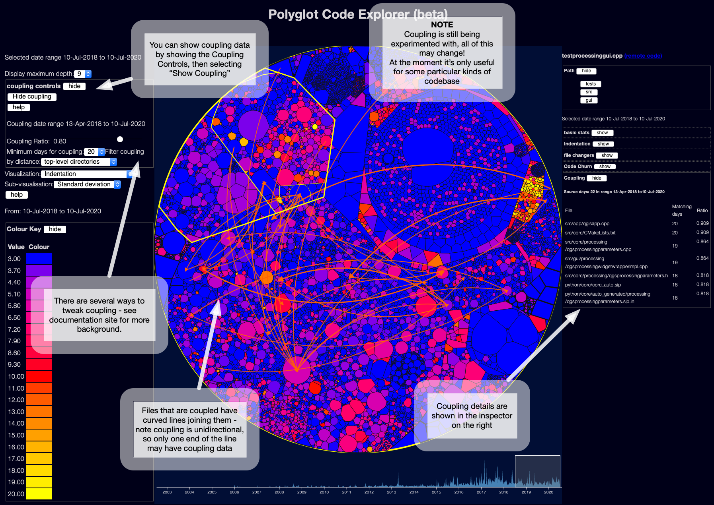

# Visualising Temporal Coupling
(back to [metrics overview](/metrics/overview))

Note that **coupling is still under development** - the first iteration works, but I think it needs a lot of refinement to be useful.

This is based on ideas from Adam Tornhill's books, plus some research - it tries to work out when files might be tightly coupled to each other, based on when the files change in git.  Adam calls this "Temporal Coupling".

If you show the coupling controls and then show coupling, you'll see a display like this:

The curved lines show which files seem to be temporally coupled to which other files.

Note each line is unidirectional - file A may be coupled to file B, but file B may not be coupled to file A.

For example, in the screenshot above, the file `testprocessinggui.cpp` had commits on 22 days in the date range selected.

The file `qgisapp.cpp` was also changed on 20 of the same days.

According to the current coupling algorithm, this means it has a ratio of 0.909 - 90% of commits to `testprocessinggui.cpp` seem to have also implied commits to `qgisapp.cpp`.

The converse might not be true -  `qgisapp.cpp` might have changed on another 20 unrelated days, so it might not have a coupling connection back to `testprocessinggui.cpp`.

Obviously this logic can produce a lot of false positives, if files change a lot coincidentally.

I think this needs redesign. I could limit coupling to changes that actually occurred in a single commit, but that wouldn't work for multi-repository projects, or to see changes where a change to file A broke a test build and forced a following change to file B.

At minimum, I might try narrowing the time window for coupling from a day, to maybe an hour, and see what happens.  (This may however make file sizes a lot bigger!)  Time permitting, of course.
