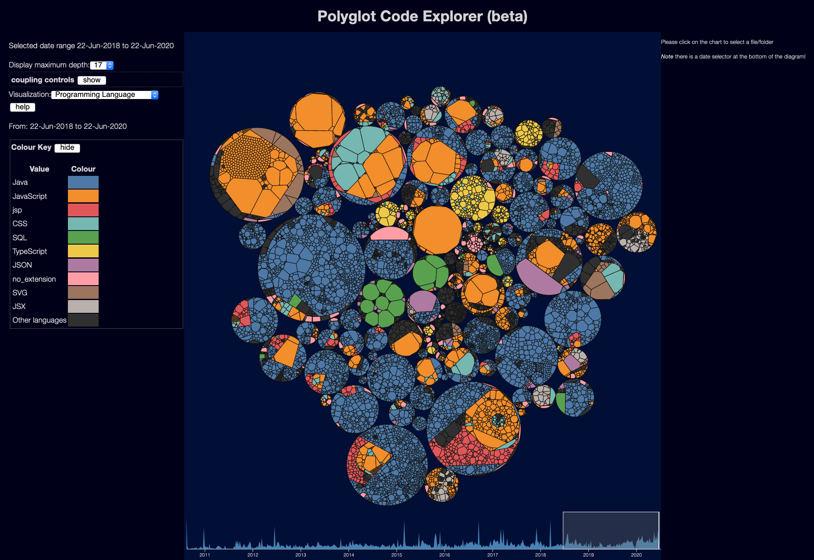

The Polyglot Code Explorer is a tool for visualising source code information.  The current interface looks somewhat like this:

It depends on [the scanner](/tools/scanner/description) and [the layout tool](/tools/layout/description) to generate the metadata - this is just the part that puts the information on a screen and allows you to explore it.

The source code is available at <https://github.com/kornysietsma/polyglot-code-explorer>

See the [howto guide](/tools/explorer/howto) for details on getting it running on your own data.

See the [Explorer user interface](/tools/explorer/ui) page for more on how to use the explorer once it is running.
