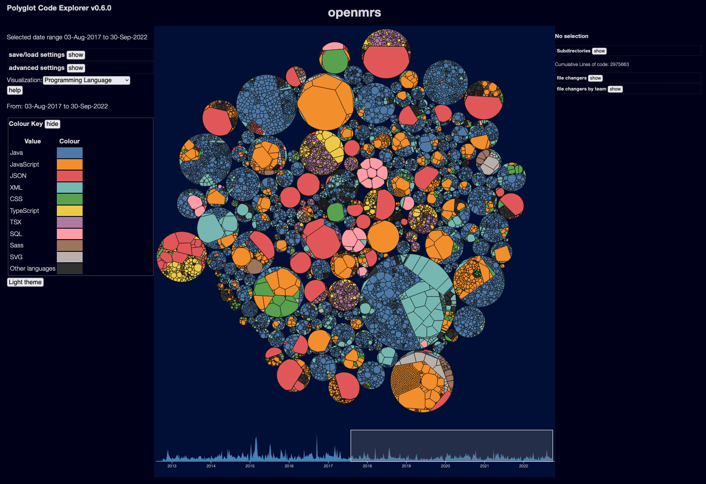

*TODO: this page is largely a placeholder, it needs more content*

The Polyglot Code Explorer is a tool for visualising source code.  The current interface looks somewhat like this:

It depends on other tools to generate the data - this is just the visualisation interface.

The source code is available at <https://github.com/kornysietsma/polyglot-code-explorer>

See the [howto guide](/tools/explorer/howto) for details on getting it running on your own data.

See the [Explorer user interface](/tools/explorer/ui) page for more on how to use the explorer once it is running.