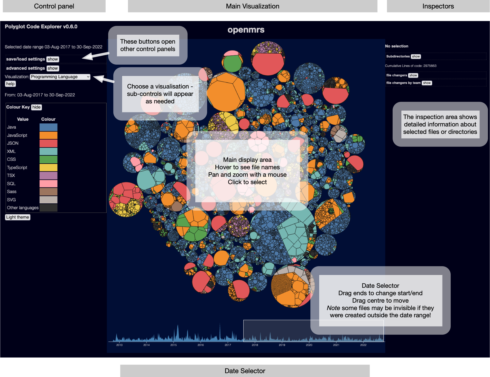
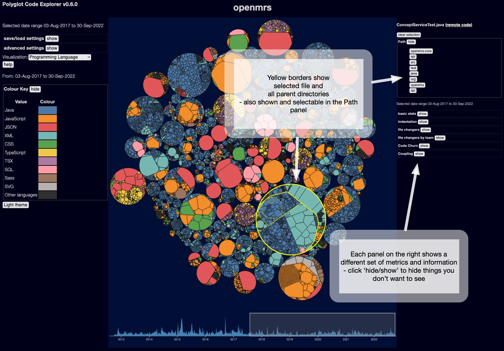

## Main interface

A typical front end of the Explorer looks like this:

The centre of the display shows the files in your project - I'm using a [Weighted Voronoi Diagram](https://en.wikipedia.org/wiki/Weighted_Voronoi_diagram) which has the big advantage of showing files roughly in proportional to their size.  And by size I'm using lines of code, which is generally much more useful than bytes - especially as research tends to show that high lines of code is correlated with complexity and defects - so just looking for large lines of code is a good starting point for finding problems.

The default layout packs all the files into a single circular Voronoi diagram, but if you [configure the layout tool correctly](tools/layout/howto) you can use circle packing for the highest level display, useful for multi-source projects.

Note the user interface is a bit responsive, but it's really designed for large displays - if you see the control panels and the center diagram stacked vertically, I suggest zooming your browser out until the display looks like the one above.  Also the date selector might not be visible at normal screen resolutions!

The center is the main display - each coloured area represents a file, if you hover over a file you'll see it's name shown.  You can zoom and pan the display with a mouse - similar to Google maps, mouse-wheel in/out to zoom, click and drag to pan.

## Inspecting files

If you click on a file, you'll see the file and it's parents highlighted in yellow, and details will show up on the inspection panel on the right:

There is a lot of data in the inspection panel!  Often too much, so you can close down areas you don't want to see with the show/hide buttons.

Note if the file is on a public github repo, there is a link to open the file on github.com (top right, next to the file name)

You can also click on a directory in the top part of the display - currently there is no summary of metrics for a directory, though, so this display isn't very useful.

## Date selection

Most data is relative to the date selection in the bottom of the display - you can drag the date selector arond with a mouse, or drag the left or right ends of the selection widget to change the size of the selection window.

_The selector only applies to data derived from git history_ - other metrics like indentation and lines of code are based on the most recent file data, and won't change as you change date ranges.

### The problem with the date selector

The scanner starts with the files currently on your filesystem - and then it works backwards in time through the git logs.  It doesn't really keep track of the actual state of your system over time, beyond what files have been renamed _which still exist_ in the HEAD revision.  If you create a file `foo.c`, and do a pile of work on it, and then delete it, the scanner will not show it - there's not really anywhere in the JSON data file to store that data! Even if you change the date selection to a time when the file existed, you won't see anything about `foo.c`.  And if you renamed `bar.c` to `baz.c` it will show up as `baz.c` throughout.  (prior to version 0.2.0 of the scanner, renames weren't handled at all, but hopefully that's fixed now)

Files that are created after the current selection are not displayed - however as the layout is not changeable at runtime, this means areas of the display showing nonexistent files will be black, but will still take up space.

## Metrics and Visualisations

See the section [Metrics and Visualisations](/metrics/overview) for details of all the main visualisations you can display.
