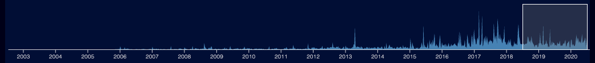

## Main interface

A typical front end of the Explorer looks like this:


**Note** that the features shown will vary depending on your scanner settings - for instance if you have specified `--no-git` then you will have no git or user-related controls at all.

The centre of the display shows the files in your project - see [Voronoi Treemap](/voronoi-treemap) for an explanation.  The colouring depends on the currently chosen visualisation.

Note the user interface is a bit responsive, but it's really designed for large displays - if you see the control panels and the center diagram stacked vertically, I suggest zooming your browser out until the display looks like the one above.  Also the date selector might not be visible at normal screen resolutions!

The center is the main display - each coloured area represents a file, if you hover over a file you'll see it's name shown.  You can zoom and pan the display with a mouse - similar to Google maps, mouse-wheel in/out to zoom, click and drag to pan.

## The Inspector

If you click on a file, you'll see the file and it's parents highlighted in yellow, and details will show up on the inspection panel on the right:


There is a lot of data in the inspection panel!  Often too much, so you can close down areas you don't want to see with the show/hide buttons.

Note if the file is on a public github repo, there is a link to open the file on github.com (top right, next to the file name)

At the top of the inspection panel is a panel showing the file name and parent directories:


This represents the file `/openmrs-core/api/src/test/java/org/openmrs/api/ConceptServiceTest.java` - if you click any of the directories it will select that directory.

## Inspecting directories


This shows the directory `/openmrs-core/liquibase` - it has two subdirectories `scripts` and `src`

You can use the subdirectory buttons to navigate - this can be useful if you want a specific directory or file but can't find it in the UI!  Note if you chose "clear selection" the directory inspector will effectively show the root directory, and you can navigate via sub-directories from there.

Directories show less information than files - if you have git data, you will see changes by user and possibly by team, but most detailed information can't be sensibly aggregated at a directory level.

## Date selection



Date-based data displays are limited by the date selection in the bottom of the display - you can drag the date selector arond with a mouse, or drag the left or right ends of the selection widget to change the size of the selection window.

_The selector only applies to data derived from git history_ - other metrics like indentation and lines of code are based on the most recent file data, and won't change as you change date ranges.

### The problem with the date selector

The scanner starts with the files currently on your filesystem - and then it works backwards in time through the git logs.  It doesn't really keep track of the actual state of your system over time, beyond what files have been renamed _which still exist_ in the HEAD revision.  If you create a file `foo.c`, and do a pile of work on it, and then delete it, the scanner will not show it - there's not really anywhere in the JSON data file to store that data! Even if you change the date selection to a time when the file existed, you won't see anything about `foo.c`.  And if you renamed `bar.c` to `baz.c` it will show up as `baz.c` throughout.  (prior to version 0.2.0 of the scanner, renames weren't handled at all, but hopefully that's fixed now)

Files that are created after the current selection are not displayed - however as the layout is not changeable at runtime, this means areas of the display showing nonexistent files will be black, but will still take up space.

## Metrics and Visualisations

See the section [Metrics and Visualisations](/metrics/overview) for details of all the main visualisations you can display.

## Saving and Loading settings

On the top left there is a collapsable panel for saving and loading project settings:


This allows you to save and load the Explorer's current UI settings - this covers almost everything you can see in the UI.

This is especially important if you are adding user and team information - this information is only saved if you explicitly choose to save it!  Otherwise a browser refresh will lose all user information.

### Save / Load to browser

This is the simplest way to save settings - "Save to Browser" saves to your browser's [Local Storage](https://en.wikipedia.org/wiki/Web_storage) - basically a way your browser can keep information even after you close the browser - a lot like cookies, but more structured.  If you have previously saved data for this project, the "Load from browser" button should appear.  But only if the saved data has the same unique ID as the current project!  If you have changed IDs you will need to load from files instead - see below.

This data is only accessible by the same browser viewing the same URL - if you want more flexibility you should try saving them to file instead.

### Save / Load to file

Instead of saving to the browser, you can save settings to a JSON file, and load them again.  You can do whatever you like with the JSON files.  **Beware** though - editing them at your own risk, there are very few checks around loading saved data, and you can easily break the explorer with bad data.

### Ignoring errors

Some errors may be recoverable - for instance, if you save settings for a project with a user "foo@bar.com" and then try to load them for a project that doesn't include that user, by default loading will fail with an error.  If you select "ignore non-fatal import errors" however, it will ignore the errors and load the settings anyway - in this case, the unknown user will be ignored.

This is very useful for loading settings with a different unique ID - for instance, if you have re-run the scanner on the same project with a different date range.

### Project versions and ID checks

As of September 2022, each project file used by the explorer has some ID information:

```json
{
  "version": "1.0.4",
  "name": "sample",
  "id": "438fc2b5-06b9-49a6-9da9-4c7ff91bf6e0",
```

The `version` field is the version of the project data structure - this is mostly used to make sure the version of the Explorer you are using is compatible with the data produced by the Scanner and Layout tools.

The `id` field is used to uniquely identify the project file.  By default it is a random UUID - you can specify an ID yourself when you run the scanner if you want, though UUIDs are safer.

When you save browser settings it also saves this information in the settings JSON file:

```json
{
  "dataVersion": "1.0.4",
  "formatVersion": "1.4.1",
  "name": "sample",
  "id": "438fc2b5-06b9-49a6-9da9-4c7ff91bf6e0",
```

Here the `dataVersion` is the same version as above.  The `formatVersion` is the version of settings files that the Explorer knows how to parse - this will only change if you download a new, incompatible version of the Explorer.

If you try to load settings from a file with a different ID, or a different formatVersion, the loading will fail with an error!  The explorer assumes that this is a mistake.  If you really want to try load this file, select "ignore" and try again.

**NOTE** this means a normal workflow, if you want to run the scanner multiple times against the same projects, you need to either override the random ID, or choose the "ignore errors" option when loading old settings files.

## Advanced Settings

At the top left of the UI there is a (collapsed) "Advanced Settings" panel:


The "Users and Teams" button opens the Users and Teams interface - see below.

"Display Maximum Depth" allows you to limit how many subdirectories are shown - this can be useful on huge projects to speed up navigation.

"Metric for comparing users and teams" controls how users and teams are compared - see [User/Team impact metric](/metrics/user-team-impact-metric) for more

"Code Server" - see the [Simple Code Server](/tools/simple-code-server/) page for more on the code server

"Remote url template" - this allows you to change how links to external code are generated.  The default is `https://{host}/{path}/{project}/blob/{ref}/{file}` - this works for github, if your code is on a different site you will need to change this field.  TODO: this needs better docs, sorry! There are some in the online help if you need it.

## Users and Teams

See [Users and Teams](users-and-teams)
