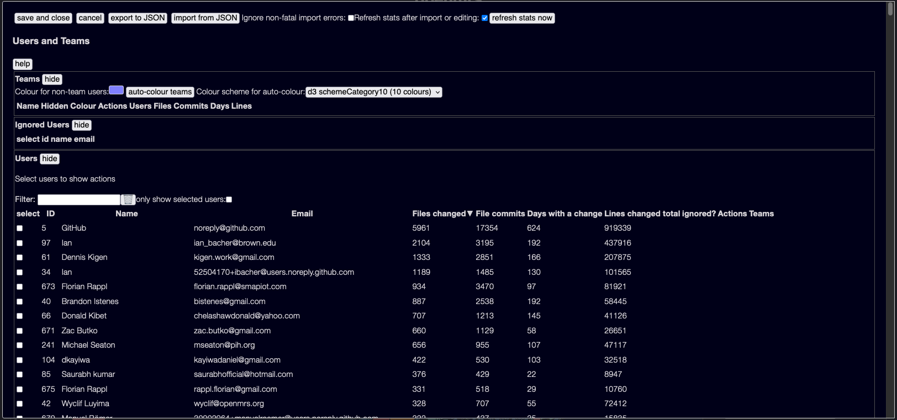
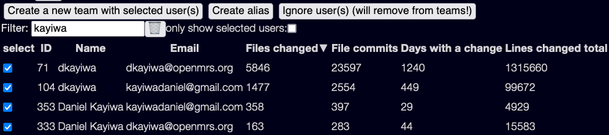
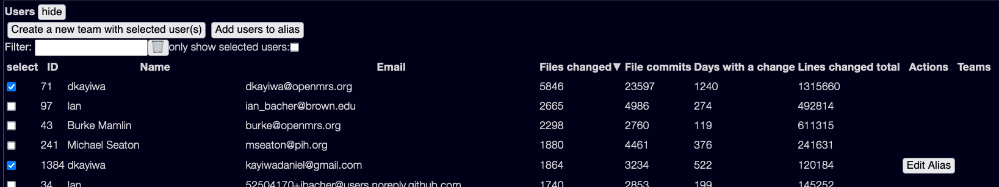
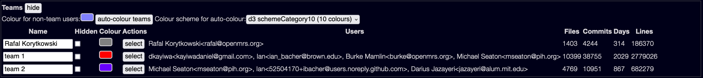

As of version 0.6 of the Explorer, you can now manipulate users and create teams of users.  I've long felt that teams and team interactions are a key part of good software development, and the heart of Agile development is autonomous, well structured teams.  So I wanted to be able to visualise them!

Note that teams are not currently stored in the normal JSON project files at all - you need to enter the team information yourself, and save it yourself.  I recommend reading about [Saving and Loading settings](/tools/explorer/ui#saving-and-loading-settings) - though you can also save user and team information separately, more on this below.

## The Users and Teams dialog

To view and change Users and Teams, click the 'Users and Teams' button - it's normally hidden in the 'Advanced settings' control panel.

Initially when you have defined no teams, you will see a diagram like this:



There are no teams defined yet, just users.

**NOTE** Unlike most of the explorer, this is a _modal_ dialog - changes you make here are strictly local, until you choose "Save and Close".  If you make changes and click "cancel", those changes are lost.

## Users and user actions

You can sort the list of users by clicking a column header.

You can filter the list of users by entering text in the 'Filter' field, this will show any users with names or emails containing the filter.

You can select users for further actions by clicking in the 'select' column.

Each user shows some stats _for the currently selected date range_ - it can be worth selecting dates carefully when building teams.  Stats are:

* Files - the number of files touched in any way
* Commits - the number of commits made to files - note that this is (commits * files) - a single commit that touches 10 files counts as 10 in this statistic.  (it has to work this way, as the data file doesn't store every individual commit)
* Days - the number of days that any files were changed
* Lines - the total of lines added + lines deleted to any files

### Ignoring users

The scanner scans for _all_ users who have interacted with a file - in git terms, this is Authors, Committers, and people mentioned in a `Co-authored-by` commit comment.  This may well include users like `noreply@github.com` that don't really have any meaning here!

You can ignore these users - select them, then click 'ignore user(s)' - they will then move to the "Ignored Users" section, and will otherwise be ignored.

### Aliasing users

If you look at the user list above, there are two very similar users:

* Ian / ian_bacher@brown.edu
* Ian / 52504170+ibacher@users.noreply.github.com

This is very common - people use all sorts of different git identities.  This is especially true if you use `Co-authored-by` tags - typically these aren't validated, so it is easy for them to have misspellings.

This is what aliases are for - you can merge all the users that are one real user.  This is where filtering becomes handy - you can filter by name and find multiple similar users:



Then select "Create Alias" - another dialog will show, where you can assign a name and email to the alias.

Once you have created an alias, all the users above will disappear, and only the alias user will show up. They will have an 'edit alias' button next to them in the user list so you can edit them and/or remove users.

To add a user to an existing alias, select the alias and one or more users, and an 'Add users to alias' button will be shown:



### Creating teams

To create a team, select one or more users and click "Create a team".

**NOTE** a team can consist of a single user!  This is often useful for tracking individual users.

The team will be named automatically - either "Team 1" or the name of the user if the team has a single user in it.  You can edit the name in the teams list.

## The Teams List



There is a lot happening here!

### Team name

You can edit a team name! Just click in the name, type a new value, and click the "tick" button.  Duplicate team names are not allowed, the tick will be greyed out.


### Hiding a team

You can hide a team by clicking the 'Hidden' column checkbox.  The team will then be invisible to the rest of the Explorer.  This can be very useful if you want to play with different combinations of teams - define the teams you want, and hide the others.

### Selecting, Adding, Removing users

The 'Select' button selects all users in a team in the User list below.

If you have users selected, "Add Users" and "Remove Users" buttons will show up, they add and remove the selected users from the team.

### Team stats

These stats are the same as the user ones listed above, but across a whole team.  Note that they are aggregated at a team level - so if 5 users from a team changed a file in one commit, it only counts as a single file modification not 5.

### Colour Schemes

Each team has a colour assigned to it, grey by default.

This is used in the visualisation, and wherever the team is shown in the Explorer, such as in inspectors.

You can manually change the colour by clicking on the colour swatch.

You can also auto-assign a colour - select a colour scheme from the drop-down list of colours, then click "auto-colour".

**Note** that each colour scheme only has a limited number of colours - see <https://github.com/d3/d3-scale-chromatic#categorical> for the D3 colours, I also have a 20-colour scheme if you _really_ need it.

There is a lot of research that indicates that we really can't distinguish that many colours at all well.  I strongly recommend you try to only show a small number of teams at once, then you can use nice distinct colours.

### The 'no team' colour

There is a special colour for users not assigned to a team - this is used in some visualisations, you can change it here by clicking the colour swatch.  See individual visualisation docs for more.

## Exporting and importing

User and team information is saved in the [normal save and load settings controls](/tools/explorer/ui#saving-and-loading-settings) controls - but sometimes you want to save just users and teams, not other settings.  This is especially true if you want to save multiple scenarios, or if you want to edit team information externally.

So the 'Export to JSON' button saves the currently displayed settings to a JSON file, and the 'Import from JSON' loads settings from a JSON file.

If the data doesn't load cleanly, you will see error messages.  You have the option, _at your own risk_, of clicking "ignore non-fatal import errors" to ignore most errors.

This is especially useful if you want to use the same user list across different projects.  For instance, at one client I scanned their entire code base, and built up user information all their projects.  I then ran a separate scan of just a core subset of projects - but if I tried to load the user information from the first scan, it would produce errors as there were users in the superset of projects that weren't defined in the subset.  Hence the need to be able to ignore errors!

### Data Format

The data format is possibly subject to change, but I also tried to keep it simple enough that people could potentially manipulate it.  If you have a list of teams and team members in some other system, you could use that to construct or modify the JSON files used here.

The format looks like:

```json
{
  "formatVersion": "1.3.4",
  "teamsAndAliases": {
    "aliasData": [
      {
        "name": "Fred Blog",
        "email": "fred@gmail.com"
      },
      {
        "name": "Jay Smyth",
        "email": "j@smyth.com"
      }
    ],
    "aliases": [
      [
        {
          "name": "Jay Smyth",
          "email": "j@smyth.com"
        },
        {
          "name": "Jay Smyth",
          "email": "j@smyth.com"
        }
      ],
      [
        {
          "name": "Jehosophat Smyth",
          "email": "jh@smyth.com"
        },
        {
          "name": "Jay Smyth",
          "email": "j@smyth.com"
        }
      ]
    ],
    "teams": [
      {
        "name": "Alpha",
        "users": [
          {
            "name": "Jay Smyth",
            "email": "jay@smyth.com",
            "isAlias": true
          },
          {
            "name": "Fred Blog",
            "email": "fred@gmail.com",
            "isAlias": false
          },
        ],
        "colour": "#0432ff",
        "hidden": false
      },
    ],
    "ignoredUsers": [
      {
        "name": "GitHub",
        "email": "noreply@github.com"
      }
    ]
  }
}
```

Note that `Aliases` is a list of pairs of identities - the first one is the user being aliased, the second one is the alias to use.  The alias must also exist in the `AliasData` list!

This data format is very verbose and full of redundant data - somewhat deliberately as I tried to make it quite robust when data changes.  Internally teams and users are stored in a much more normalised form!

## Visualising teams and users

See the [Metrics and Visualisations](/metrics/overview) section for individual visualisations.