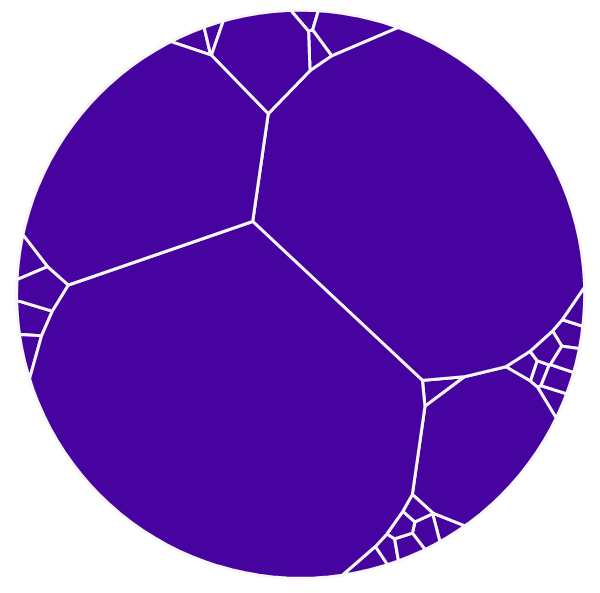
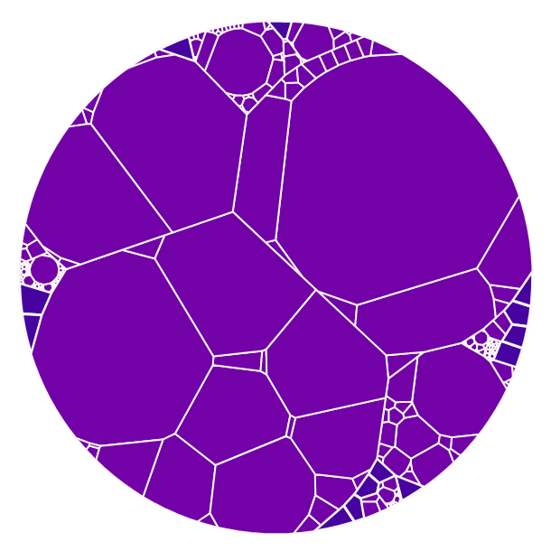
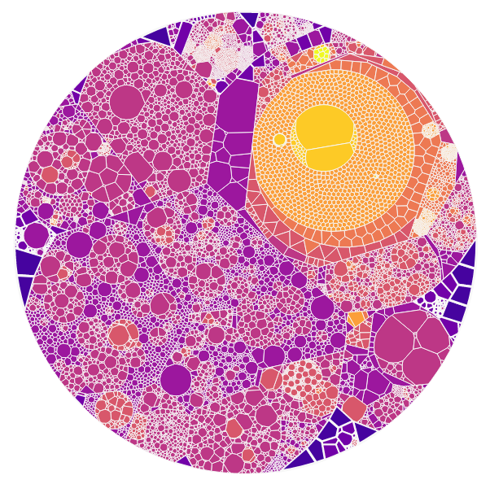
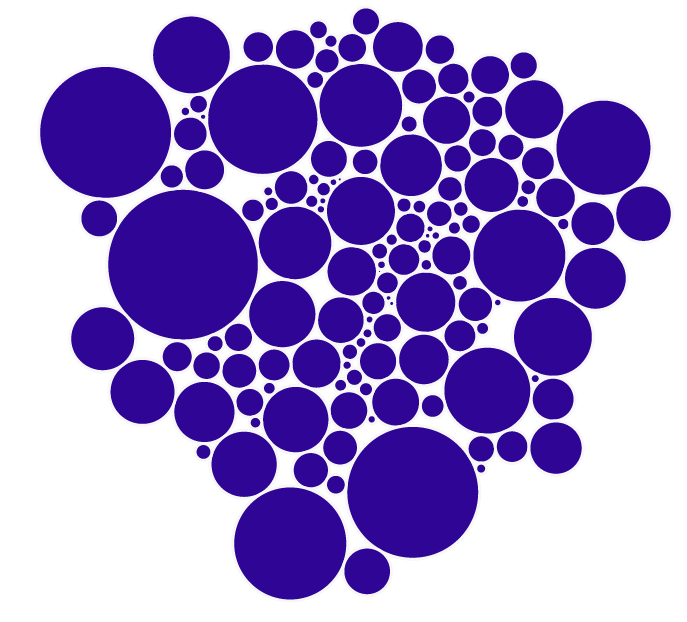
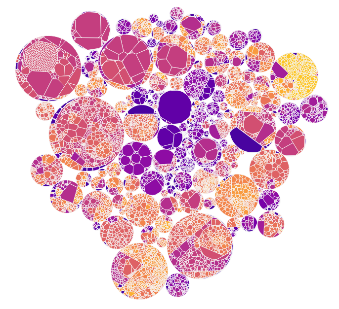

The Offline Layout tool is a script to calculate the layouts used by the [explorer](/tools/explorer/description) - it runs offline as the layout algorithms are too slow to run in a browser.  It uses a mixture of weighted Voronoi Treemap layouts and Circle Packing.

The source code is available at <https://github.com/kornysietsma/polyglot-code-offline-layout>

I use Franck LeBeau's [d3-voronoi-treemap](https://github.com/Kcnarf/d3-voronoi-treemap) library - or more specifically, it's underlying [d3-voronoi-map](https://github.com/Kcnarf/d3-voronoi-map) library - to do the Voronoi calculations.

## What is a weighted voronoi treemap?

A [treemap](https://en.wikipedia.org/wiki/Treemapping) is generally a way of representing a hierarchy of data in a recursive way.  A weighted treemap is weighted so that each node has area proportional to it's value - in our case, to the lines of code.

Traditional D3 treemaps are typically rectangular: <https://observablehq.com/@d3/treemap> - this is where I started out.  But rectangular maps get quite hard to understand visually - edges line up in ugly ways, and you can't really see what is a parent and what is a child.

Instead, I'm using a layout based on [Weighted Voronoi Diagrams](https://en.wikipedia.org/wiki/Weighted_Voronoi_diagram) - which also have the property that each area shown is proportional to the value, but are much more organic.

## How is this a tree?

The Voronoi layout algorithm is applied recursively for each directory and subdirectory in the codebase.  For example, when laying out the [qgis codebase](http://polyglot-code-explorer.s3-website.eu-west-2.amazonaws.com/) the first level is laid out like this:

where each segment is one top-level directory like `/src` or `/test`, with a size roughly proportional to the total lines of code inside that directory.

Then each segment of this diagram is subdivided with another voronoi layout:

Here each segment is a file or directory one layer deeper, such as `/src/core`

This continues until all files are mapped (though you can set a limit in the UI, with the 'display maximum depth' advanced option):

## What about those circles on some diagrams?

The layout tool has a command-line option `--circles` which uses [d3's circle packing algorithm](https://observablehq.com/@d3/circle-packing) for just the top layer of layout.

This is very useful for when you have multiple repositories - each repository (or each top-level directory at least) is shown as a circle, which makes the split between repositories clearer.

Circle packing still keeps areas proportional to "size" in terms of lines of code, as long as we only use the circle packing algorithm at the top level.

For example, the [openmrs codebase](http://polyglot-code-explorer-openmrs.s3-website.eu-west-2.amazonaws.com/) is made up of many repositories - if you view just the top level circles, it looks like this:

Here each circle is a whole git repository.

Deeper layers are then laid out using the same Voronoi algorithm as above:

And so on, until the final layout is:

## Why is this run offline?

There are two big problems with the libraries I am using:

1. They are slow for big diagrams - sometimes quite painfully slow
2. They are not always successful - sometimes initial positions never get a good solution.

### Slowness

The slowness might be improved in some cases with a lot of code optimising.  But it might be somewhat inherent in the kind of layouts I'm using.  Some source code directories are huge - and the Voronoi algorithms are iterative, and sometimes they take a long time to get a good solution.

I'd love to build a carefully optimised implementation - possibly in rust using WebAssembly - but it would be a lot of work - and even then, it might not be fast enough, and you'd need a lot of JavaScript work to do the layouts incrementally without blocking the browser.

So as I don't have time or brain space to do all this work, I decided to cheat.  I use Franck LeBeau's code, but instead of running it in a browser, I run it offline using node.js, and save the resulting layout for use later in the browser.

### Failures and bugs

The other problem is that the layout doesn't always find a solution.  As of [version 2.1.0](https://github.com/Kcnarf/d3-voronoi-map/releases/tag/v2.1.0) the main bugs that plagued me previously have been fixed - but still on occasion the layout throws a strange exception on encountering an edge case, or it just doesn't find a good solution.  (The way the algorithm works is it defines starting positions for the algorithm randomly, and then iterates to find a solution - and sometimes those starting positions just don't work well.)

So my layout application runs the Voronoi algorithm in a loop - every time I start the loop, it uses different random starting points, so I keep going until I get a good enough solution - or if I have looped too many times, I give up and just choose the best solution I've seen so far.

This of course is even slower!  In big codebases, recursively finding layouts can take over an hour.  So again, better to do this offline than to try to squeeze it into a browser.

## What are the downsides?

The biggest issue is that the layout can't change in the UI.  You can't exclude files and re-draw the layout, or go back in time and re-draw the layout - whatever you got from this tool, you are stuck with.  So you can't (say) decide to exclude all XML files in the UI - if you decide you want to show source but not data, you need to re-run the initial scan [with an ignore file](/tools/scanner/howto#ignoring-files) and then re-calculate the layout from scratch.

Also sometimes the result still isn't quite accurate.  The layout doesn't always converge to a perfect result.  It's probably good enough for most purposes - but it's not always quite right.  That's why I still have a visualisation that highlights file size, so you don't have to trust your eyes.

## Have you considered other algorithms?

I tried rectangular treemaps first - I don't like them much.

I'd love to try a [Gosper treemap](https://blockbuilder.org/nitaku/8787855) just because I love fractals.  If I find the time.  It might also solve the speed problem - but it's not as easy on the eyes for a deeply nested tree as the Voronoi layout, I tend to think.
